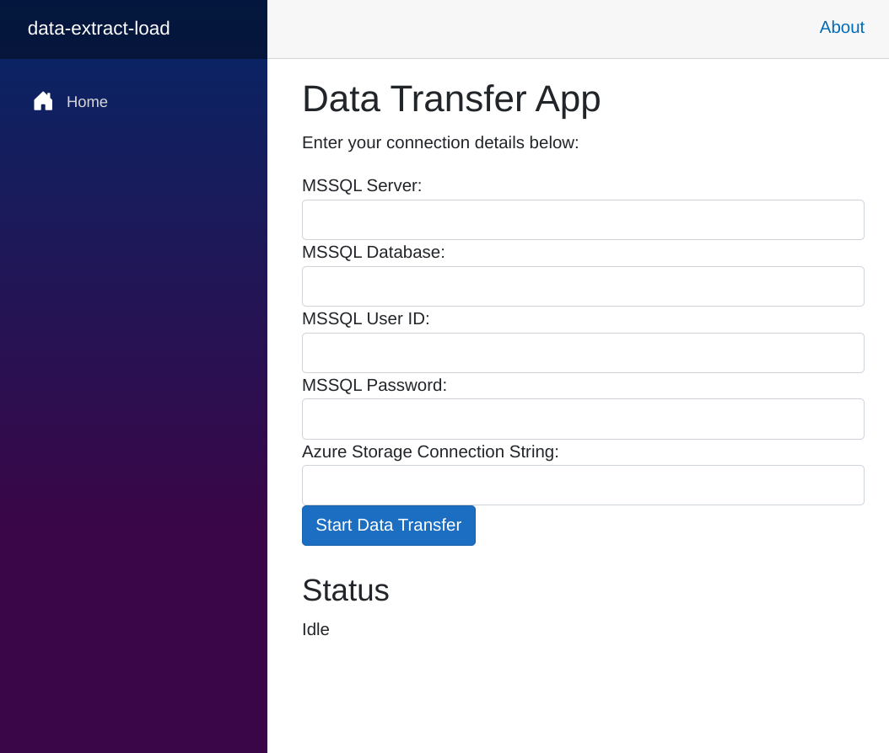

# Data Copy App

This Blazor app is designed to copy data between MSSQL database and Azure Storage.

## Getting Started

Previews should run automatically when starting a workspace.

## Configuration

Before running the app, you need to configure the connection details for your MSSQL database and Azure Storage. These details should be provided through environment variables or within the `appsettings.json` file.

**Required Configuration Settings:**

-   **MSSQL Connection String:** The connection string to your MSSQL database.
-   **Azure Storage Connection String:** The connection string to your Azure Storage account.
-   **Source (MSSQL or Azure Storage):** Specify whether the source of data is MSSQL or Azure Storage.
-   **Destination (MSSQL or Azure Storage):** Specify whether the destination of data is MSSQL or Azure Storage.
-   **Other relevant details:** Depending on the specific copy operation (e.g., container names, table names, query).

## Running the App

1.  Ensure you have provided the necessary configuration details as described in the "Configuration" section.
2.  Run the application using the standard .NET command: `dotnet run`

 

